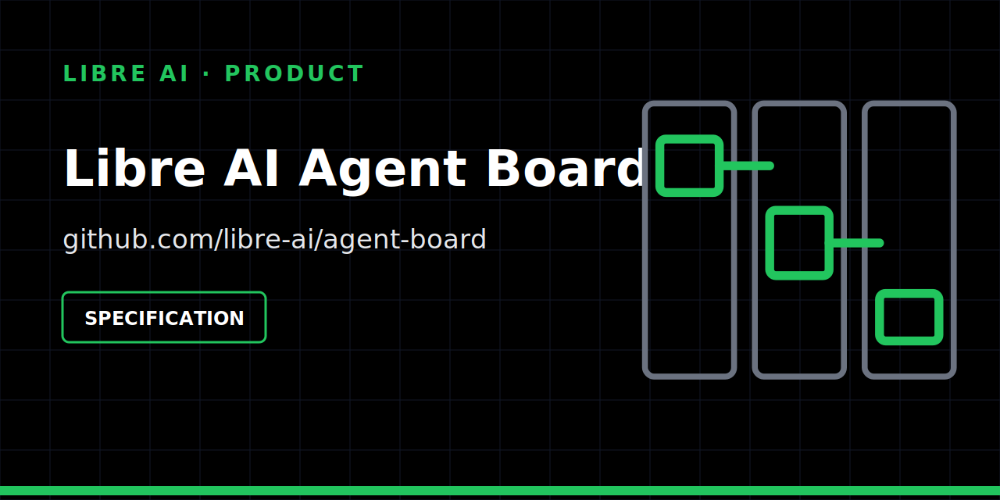

  

# Libre AI Agent Board

A future human-and-agent work surface for tasks, blockers, approvals and evidence.

## Status

| | |
| --- | --- |
| Maturity | **Specification** |
| Works today | product boundary, contribution roadmap and security policy |
| Not available | there is no runtime, local board or hosted collaboration product |
| Historical ID | `rumble-crew` may remain in historical references only |

This repository intentionally avoids presenting a specification as an operational product.

## Product boundary

Agent Board is intended to make agentic work understandable and governable:

- who is doing what and why;
- current status and blockers;
- required human decisions and approvals;
- evidence attached to execution outcomes;
- bounded visibility of skills and activity.

It does **not** execute or route agents, inspect tools, store generic artifacts, or replace a general project-management suite. Those concerns remain independent and are connected through explicit contracts.

## Next evidence

The next milestone is a fixture-backed `AgentTaskRequest` lifecycle with explicit approval, failure and recovery semantics. A runtime should not be announced before that contract is visible and tested.

## Contributing

Start with:

- [Roadmap](ROADMAP.md)
- [Contribution guide](CONTRIBUTING.md)
- [Security policy](SECURITY.md)

Contributions should improve observable contracts and evidence rather than add speculative platform scope.

## License

[MIT](LICENSE).
